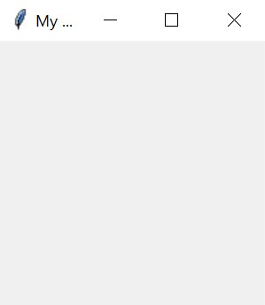
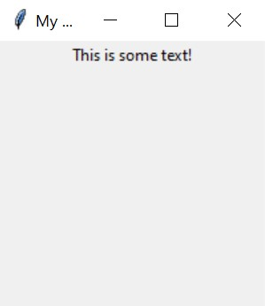
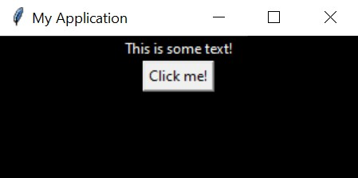
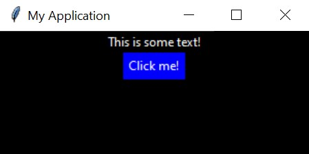

# tkx (tkinter superset) *
## Disclaimers
* This project was written in Python version 3.10 and has yet to be tested with earlier versions of the language.
* Developers using WSL may encounter issues stemming from their `DISPLAY` environment variable. The author has yet to find a solution to this problem.

## Table of Contents
1. [Getting Started](#getting-started)
2. [Example Project](#example-project)
3. [Documentation](#documentation)

# Getting Started
### Installation
First, make sure you have a compatible version of Python installed along with tkinter. The author also recommends using a virtual environment when following this guide.

Run the following command:
```
python -m pip install git+https://github.com/piccoloser/tkx.git
```

If you don't get any errors, tkx should be successfully installed.

# Example project
*This section will disregard comparisons to tkinter's syntax in favor of being concise.*

Let's create a project folder and within it add a new Python file called `main.py`, then paste the following code.
```python
# main.py

import tkinter as tk
import tkx


def main():
    root = tkx.Window("My Application")
    root.mainloop()


if __name__ == "__main__":
    main()

```

Running this script will open the following window:



To add a new text label to this window, we'll use the `add` method **before** `root.mainloop()`.

```python
# main.py
# ...

root = tkx.Window("My Application")

root.add(tk.Label, text="This is some text!")

root.mainloop()

# ...
```

Now the window should display some text.



A major feature of tkx is the ability to style widgets with Cascading Style Sheets (CSS), a language used heavily in the world of web design for the purpose of describing how HTML elements look.

Let's create another file in our project folder and name it `style.css`. In this file, paste the following:

```css
Window {
    background: black;
    width: 300;
    height: 120;
}

Label {
    background: black;
    color: white;
}
```

Now in `main.py`, **above** where we defined our window, we'll add a line for the stylesheet, and pass it to `root` as an argument:

```python
# main.py
# ...

stylesheet = tkx.Stylesheet("./style.css")
root = tkx.Window("My Application", stylesheet)

# ...
```

The window should now appear with a black background and white text.


We use a relative path `./style.css` to refer to our new CSS file. This path is validated using `pathlib` and the file contents are automatically parsed into usable Python code as soon as we create the `tkx.Stylesheet`.

Next, let's change the color of our text when the user clicks a button. First, we'll add the button itself...

```python
# main.py
# ...

root.add(tk.Label, text="This is some text!")

my_button = root.add(tk.Button, text="Click me!")

# ...
```

*Notice how in order to reference our element (in this case, a button) we need only assign it to a variable.*

Then, we'll assign our label to a variable so it can be referenced in our function...

```python
# main.py
# ...

my_label = root.add(tk.Label, text="This is some text!")

# ...
```

Then, we'll add the actual functionality to our button. Here's the full code snippet:

```python
import tkinter as tk
import tkx


def change_color(label, color):
    """Change the foreground (fg) color of a given label."""
    label.configure(fg=color)


def main():
    stylesheet = tkx.Stylesheet("./style.css")
    root = tkx.Window("My Application", stylesheet)

    my_label = root.add(tk.Label, text="This is some text!")

    root.add(
        tk.Button,
        text="Click me!",
        command=lambda: change_color(my_label, "cyan"),
    )

    root.mainloop()
    

if __name__ == "__main__":
    main()

```

*Explaining the use of `lambda` in the declaration of our button is beyond the scope of this guide. Please refer to this [W3Schools](https://www.w3schools.com/python/python_lambda.asp) page for more details about lambda functions.*

Here's what the result looks like:



Great! Clicking this button will change the color of our text from white to cyan. Now let's add some styling to the button:

```css
/* main.css */
/* ... */

Button {
    background: blue;
    color: white;
    border-style: flat /* tkinter equivalent of "solid" */
}

/* ... */
```

Now you'll see that the button is blue with white text and a solid border.



Before wrapping up this guide, we can reduce repetition in our CSS by using variables. In CSS, variables are defined using a selector called `:root` and referenced using the `var()` function.

Update your CSS such that it matches the following:

```css
/* CSS variables must begin with double hyphens. */
:root {
    --background: #000; /* You can use hex values as well. */
    --foreground: #fff;
    --blue: #00f;
}

Window {
    background: var(--background);
    width: 300;
    height: 120;
}

Button {
    background: var(--blue);
    color: var(--foreground);
    border-style: flat;
}

Label {
    background: var(--background);
    color: var(--foreground);
}
```

*Running the program after making these changes will display the exact same window.*

This way, we can update items that share those variables without having to change each and every one of them.

**Congratulations**, you've created your first program using tkx!

# Documentation

## Classes
### Element
*Inherits from [`TkxElement`](#tkxelement)*

The `Element` class is a wrapper around a tkinter widget, and should be created indirectly via its parent's `add` method. The root of the hierarchy should be a [`Window`](#window).

#### `Element` Attributes

##### **`cl`**
Describes the element's CSS `class`, which can be used in a stylesheet to target that element and others with the same class. Multiple classes can be applied to one object by separating them with a single space, with properties from latter classes overwriting that of the former.
* **Important:** `class` is a restricted keyword in Python which cannot and should not be used outside the context of creating a Python class. `cl` is the only accepted word for this property.
* As of writing, properties defined in `id` will be overwritten by those defined in `cl`. If a value defined in `id` is not touched by a CSS class, it will be left as is.

##### **`elements`**
List of `Elements` contained within this object.

##### **`id`**
Describes the element's `id`, which can be used in a stylesheet to target that specific element. Only one element can be created with each `id`.

##### **`parent`**
The `Element` or `Window` which contains this object.

#### `Element` Methods

##### **`bind(**kwargs)`**
This method directly wraps the `bind` method of this `Element`'s widget. See the [tkinter](https://tkdocs.com/shipman/binding-levels.html) and [Tkl/Tk](https://www.tcl.tk/man/tcl8.6/TkCmd/bind.html) documentation for more information on the `bind` method.

##### **`configure(args: dict[str, Any] | None = None, **kwargs)`**
This method handles keyword arguments specific to `Element`, then passes the rest directly to the `configure` method of the `Element`'s widget. See the [tkinter](https://tkdocs.com/shipman/std-attrs.html) documentation for the standard attributes which can be applied using the `configure` method.

### Stylesheet
The `Stylesheet` class is a CSS parser and container for parsed styles. A `Stylesheet` can be passed to a [`Window`](#window) in order to apply styles to it and its child elements.

#### `Stylesheet` Attributes

##### **`styles`**
A `dict[str, dict[str, str]]` of the style values read from a CSS file.

##### **`source_min`**
The minified CSS source code of this object.

#### `Stylesheet` Methods

##### **`format_properties(dict[str, Any]) -> dict[str, str]`**
Replaces all values matching CSS variables (eg. `var(--my-variable)`) with their corresponding values in the CSS `:root` block.

##### **`get(str) -> str | None`**
Returns the CSS block associated with the given selector or `None` if it does not exist.

##### **`get_blocks() -> tuple[str]`**
Returns a list of CSS blocks as defined in the CSS source code.

##### **`get_property(widget_name: str, property: str) -> str | None`**
Returns the value of a property given a selector and property name. If not found, this method returns `None`.

##### **`get_selectors() -> tuple[str]`**
Returns a list of CSS selectors as defined in the CSS source code.

##### **`minify_css(source_path: str) -> str`**
Given the contents of a CSS file as a string, returns the contents with unnecessary spaces and comments removed.

##### **`parse_block(block: str) -> dict[str, str]`**
Returns a minified CSS block as a `dict[str, str]`, where CSS key names have been translated to tkinter-supported key names.

##### **`var(value: str) -> str | None`**
If a value matches the syntax of a CSS variable (eg. `var(--my-variable)`), returns the associated value from the CSS stylesheet's `:root`, otherwise returns the unchanged value.

### TkxElement
#### Inherited By
* [`Element`](#element)
* [`Window`](#window)

#### Introduced Methods

##### **`add(widget: tk.Widget, **kwargs)`**
Creates a new `Element` containing the specified widget with `self` as the `Element`'s parent. Also appends the new object to `self.elements`.

##### **`get_style_of(name: str, fallback: str | None = None) -> dict[str, str]`**
Returns the style of a widget which has been defined in a stylesheet, given the widget name (eg. `tk.Frame.__name__ -> "Frame"`), or optionally the style of another `fallback` widget.

##### **`parents()`**
Returns an ascending generator over the ancesters of a `TkxElement` ending with the root (inclusive).


#### Introduced Properties

##### **`root`**
Returns the root `Window`.

##### **`style`**
Returns the style dictionary (`dict[str, str]`) associated with the object, creating and returning a new `dict` if it doesn't already exist.

##### **`widget`**
Returns the tkinter `Widget` associated with the object or `None` if it doesn't exist.

### Window
*Inherits from [`TkxElement`](#tkxelement)*

The `Window` class is a subclass of tkinter's `Tk` widget. The only visual change from tkinter's default behavior is that `self.pack_propagate(0)` is called on instantiation.

#### Creating a `Window`
Optional title `str` and `Stylesheet` arguments can be passed directly to the `Window.__init__` method, making the creation of a titled window with an applied stylesheet a one-liner. The `width`, `height`, `x`, and `y` attributes are also automatically recalculated and ready for use once the object has been instantiated.

If a stylesheet has not been passed to the `__init__` method, `self.style` will be equal to `None`.

#### Window Attributes

##### **`cls`**
`ClassList` containing every CSS class used by this object's child elements (automatically populated).

##### **`elements`**
List of `Elements` contained within this object.

##### **`ids`**
`dict[str, Element]` mapping CSS ids to their respective `Element` within this object's child elements (automatically populated).

##### **`stylesheet`**
The `stylesheet` passed to this object during instantiation.

## Decorators
### `@update_style`
*Function Decorator*

This decorator extends the `configure` method of objects which inherit from [`TkxElement`](#tkxelement).

Methods extended by this decorator will have their argument values parsed as CSS properties *into* valid tkinter values. Already valid values will be unchanged, whereas values containing CSS-specific syntax will be translated.

#### Functionality
* CSS Variables (depends on an associated `Stylesheet`)
* Percent Values (depends on the same values in the object's parent)

#### Implemented By
* [`Element`](#element)`.configure`
* [`Window`](#window)`.configure`